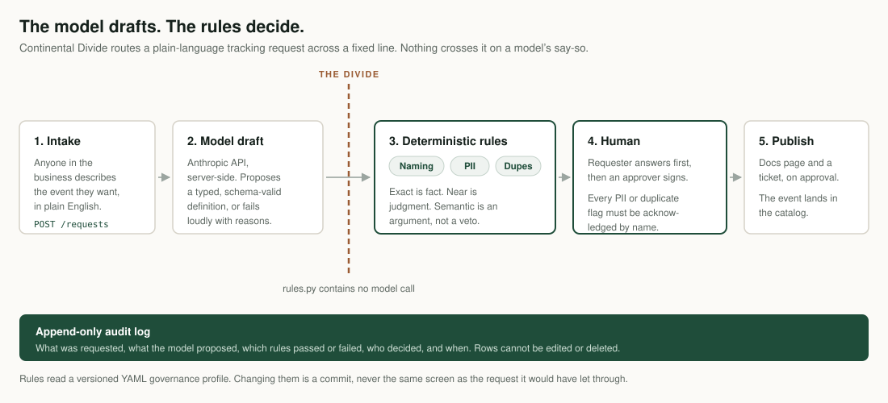

# Continental Divide

Continental Divide turns "I need to know something about our users" (asked in plain
English by anyone in a business) into a spec-compliant, human-approved, documented
tracked event.

Every company I've worked with has the same failure: the tracking plan and production
drift apart, and the plan becomes a lie. This is a clean, open implementation of the pattern
I kept rebuilding. Continental Divide takes a plain-language request for a new tracking event,
turns it into a typed and validated definition, routes it for approval, and on approval
publishes the documentation, opens a ticket, and adds the event to a data dictionary
anyone in the business can read. Every step is recorded.

The shape is simple: define once what a correct event looks like, let a model do the
drafting, and keep every decision with deterministic rules and a human. The model is fast
and useful and occasionally wrong, so it is never the thing that decides.

The name is the idea. A continental divide is the line that decides which way the water
flows. This tool is the line a tracking request has to cross, and it decides what gets through.



## How it works

1. **Intake:** someone describes the event they want to track, in plain language.
2. **Draft and validate:** a model turns that into a structured event definition. It
   conforms to the schema or fails loudly, with the reasons shown. The model only drafts:
   deterministic rules then check naming, flag PII, and catch duplicates against the
   tracking plan, and the model cannot talk its way past them.
3. **Confirm:** the requester sees what was drafted and what the tool found before anyone
   else does. If it looks like something that already exists, they can take the existing
   event instead, pass the question to the approver, or say in writing why it won't work
   for them. Nothing enters the approval queue until they say so.
4. **Approve:** the request routes to a human, who must acknowledge any duplicate or PII
   flag by name before approving.
5. **Publish:** on approval, the tool publishes the event documentation and opens a
   tracking ticket. Out of the box this uses a mock publisher, so the whole flow runs
   with no external accounts.
6. **Browse:** every approved event lands in a data dictionary at `/catalog`: what is
   tracked, what each event means, and which properties it carries. This is the artifact
   the rest of the business needs, and it is a page rather than a spreadsheet nobody
   maintains.

A timestamped, append-only audit log records every step: what was requested, what the
model proposed, which rules passed or failed, and who decided.

## Stack

- Backend: Python + FastAPI, Pydantic v2 for typed, validated outputs
- Frontend: Next.js + React (TypeScript)
- Drafting: Anthropic API, server-side only
- Storage: SQLite for the audit log and request history, behind a storage interface
- Publishing: pluggable, and it runs **on approval**. A mock publisher ships by default,
  with a documented stub for a real Atlassian (Confluence and Jira) adapter
- Notion: a separate one-way push of a *pending* request to an approval board, **on
  submission** rather than on approval. It is not a publish target and Notion is not the
  system of record: the board is a place approvers already look

## Running it locally

### Prerequisites

- Python: 3.9 works, 3.11+ recommended.
- Node.js LTS.
- An Anthropic API key (see Real-key setup below). The app runs without one, but the
  intake step needs it.

### Start it

Two terminals: the backend on port 8000, the frontend on port 3000.

```bash
# Terminal 1 — backend
cd backend
python -m venv .venv && source .venv/bin/activate
pip install -r requirements.txt
cp ../.env.example .env          # creates backend/.env, then add your key (next section)
uvicorn app.main:app --reload    # http://localhost:8000
```

```bash
# Terminal 2 — frontend
cd frontend
npm install
cp .env.local.example .env.local
npm run dev                      # http://localhost:3000
```

Then open **http://localhost:3000**. Use `localhost`, not `127.0.0.1`. The backend
pins CORS to `http://localhost:3000`, so loading the UI from `127.0.0.1:3000` makes the
browser's API calls fail.

### Real-key setup

The intake step calls the Anthropic API server-side to draft a definition from the
plain-language request.

1. Get a key from the Anthropic Console (https://console.anthropic.com).
2. Put it in `backend/.env` as `ANTHROPIC_API_KEY=sk-ant-...`.
3. Never commit it. `backend/.env` is gitignored; only `.env.example` is tracked.

The key is read server-side only and never reaches the browser or any API response.
Without a key, `POST /requests` returns a 502 with a "could not draft a definition"
message and records a `model_error` step in the audit log: the request is still
persisted, and the rest of the app (queue, detail, approve/reject, the raw-definition
demo path below) still runs.

## Demo walkthrough

Four paths, each proving a different part of the contract. The first two go through the
model; the last two use a small demo affordance on the intake page ("load a raw
definition, skips the model step") so the rule cases fire deterministically without
depending on what the model writes.

- **Natural language, clean:** "track when a shopper empties their entire cart". The
  model drafts `Cart Cleared`, every rule passes, it routes to approval; approve it and
  it publishes a mock Confluence doc and Jira ticket. The happy path, end to end.
- **Natural language, PII:** "track when someone subscribes to our newsletter and
  capture their email address". The model faithfully proposes an `email` property, and the
  PII rule flags it. It is *not* auto-rejected: the request routes to approval, and the
  approver cannot approve it without acknowledging the PII on the record. The point: the
  model drafts what was asked for, the rules govern, and a human puts their name on the
  exception.
- **Raw naming violation:** a pre-built `add_to_cart` definition. The naming rule
  rejects it for not being Object Action, Title Case. A well-behaved model won't author a
  malformed name from plain English, so this path skips the model to exercise the rule.
  The rejection is not the end of it: the engine offers a compliant name it has checked
  against its own rule, one click resubmits under that name, and the requester's consent
  is recorded in the audit log. A requester who thinks the rule itself is wrong can say
  so on the record instead, which files a dispute rather than amending anything.
- **Raw duplicate:** a pre-built `Order Completed` definition, which already exists in
  the tracking plan. It's flagged as a duplicate and routed to a human rather than
  auto-rejected.

### Three kinds of duplicate

Duplicate detection is the part worth reading the code for, because the three kinds are
not the same kind of claim and the tool refuses to pretend they are.

| Kind | What it is | Who decides |
| --- | --- | --- |
| **Exact** | The name is already in the plan, character for character | Fact. The approver acknowledges it. |
| **Near** | The same name written differently: case, separators, or a plural, with the same action verb | Deterministic judgment. The requester answers first. |
| **Semantic** | A model's argument that two differently-named events mean the same thing | Inference. High-confidence findings ask the requester; the rest are shown and cost nobody an action. |

None of the three can reject a request. The engine states facts, the model makes arguments
a human can disagree with, and nothing reaches published without someone acknowledging
what fired. [`docs/adr/0001`](docs/adr/0001-three-tiers-of-duplicate-detection.md) records
why the seam sits there, including a similarity threshold that got measured, produced two
false positives against Segment's own curated spec, and was thrown out.

### Governance is a file, not a setting

The rules come from a versioned YAML profile in [`governance/`](governance/): naming
convention, PII blocklist, categories, allowed destinations. At intake that profile is
law and the model has no vote. A team that disagrees amends the profile in the setup
wizard, commits the file, and `git log` is the history: never the same screen, or the
same moment, as the request it would have let through.

## How this was built

I directed this build with Claude Code. I read code and make the product and data calls; I
don't write the Python by hand. That makes the specification the real work, and it is all
in the repo:

- [`CLAUDE.md`](CLAUDE.md): the standing instructions the agent works under. Architecture
  rules that require my sign-off to change, a frozen backward-compatibility test it may not
  edit, and the constraint that `rules.py` may never contain a model call.
- [`CONTEXT.md`](CONTEXT.md): the glossary. What each term means and which synonyms to
  avoid, so the code, the docs, and the UI say the same word for the same thing.
- [`docs/adr/`](docs/adr/): why each decision was made and what it ruled out.
- [`TASKS.md`](TASKS.md): what's done, what's next, and what was deliberately cut.

The interesting constraint is that an agent will happily agree with whoever is driving it. Most of what's
written down exists to stop that: rules the model cannot reach, a test it cannot edit, and
decisions recorded with the evidence that produced them, so a later session cannot quietly
reverse one.

Open any request's detail page and read the audit timeline. That timeline is the point of
the tool: it reconstructs exactly what happened and why, in order, and the audit rows
cannot be edited or deleted.

## Deploy notes

Not deployed yet: these are notes for later, not a deployment guide.

The shape is two services plus a database: the FastAPI backend, the Next.js frontend, and
a datastore for the audit log and request history.

- **SQLite is local-only.** The default storage writes to a single SQLite file. Any host
  with an ephemeral filesystem (most container platforms) won't persist the audit log
  across restarts, which defeats the point of the tool. A real deploy needs a durable
  database: implement a Postgres backend behind the existing `Storage` interface (the app
  talks to that interface, not to SQLite directly) and point the backend at it.
- **The intake endpoint is a cost and abuse surface.** `POST /requests` calls a paid API
  on every request. Its built-in rate limit and intake-length cap are a floor, not a
  public-facing control, and they cover that route only, not every reachable endpoint
  (see the known limits below). Before exposing it, add authentication and a usage cap.
- **Environment variables.** Backend: `ANTHROPIC_API_KEY` (required for intake),
  `ANTHROPIC_MODEL`, `DATABASE_PATH`, `MAX_INTAKE_CHARS`, `RATE_LIMIT_MAX`,
  `RATE_LIMIT_WINDOW_SECONDS`, and (for the approval-board push) `NOTION_TOKEN` and
  `NOTION_APPROVAL_DB_ID`. Frontend: `NEXT_PUBLIC_API_BASE` (the backend's URL).

## Status

The full flow works end to end: plain-language intake, model drafting, deterministic
rules, requester confirmation, human approval with PII and duplicate acknowledgment, mock
publishing, the `/catalog` data dictionary, and a one-way push of pending requests to a
Notion approval board, all recorded in the append-only audit log. A pytest suite covers
the rules, the pipeline, the HTTP flow, and the Notion mapping, alongside a deterministic
eval tier whose fixtures pin engine decisions one claim at a time; CI runs all of it plus
a frontend type-check and build on every push. Not deployed anywhere yet; see the deploy
notes above.

**The bundled sample plan.** `backend/app/sample_tracking_plan.json` holds 28 events whose
names and descriptions are reproduced verbatim from Segment's public Ecommerce V2 spec
(<https://segment.com/docs/connections/spec/ecommerce/v2/>), used here as reference
material and credited to Segment.

**Known limits, stated rather than discovered.** Duplicate detection compares against the
bundled sample plan only: it does not yet see events this tool has published, or requests
sitting in its own queue, so it cannot catch a duplicate of something it approved last
week. That boundary and its consequences are written up in
[`docs/adr/0002`](docs/adr/0002-the-duplicate-corpus-is-the-bundled-plan.md); closing it is
the next substantial piece of work. Separately, nothing yet tests that the model respects
the line between what it should report and what the engine already caught. The
deterministic eval tier covers the engine, but that check needs a live eval tier, which
does not exist yet. `POST /requests/raw`, the demo path that skips the model, has neither
the rate limit nor the size cap that `POST /requests` enforces, so the floor described in
the deploy notes covers the model-backed route only. `backend/run_examples.py` is
destructive by design: it calls `reset_storage()`, which deletes the SQLite file and
recreates the tables, so running it wipes the local request history and the audit log
along with it. And the PII rule matches tokens, so it only catches the names
it knows: `Product Shared` and `Cart Shared` in the bundled plan carry a `recipient`
property, which in practice holds an email address or a phone number and passes the check
clean. That is faithful to Segment's spec rather than a transcription error, which is the
point: a blocklist governs the words on the list, and a plan copied from a good public
spec can still hand you an unflagged identifier.

## Clean room

This is a clean-room rebuild. It carries no client code, data, names, or rules from any
prior engagement. The sample tracking plan follows Segment's public Ecommerce V2 spec and
uses generic example data; the naming convention follows Segment's public Track spec.
Secrets live in environment variables only and are never committed.

---

Built by Calvin Edson. A Bristlecone Echo asset: roots before branches.
